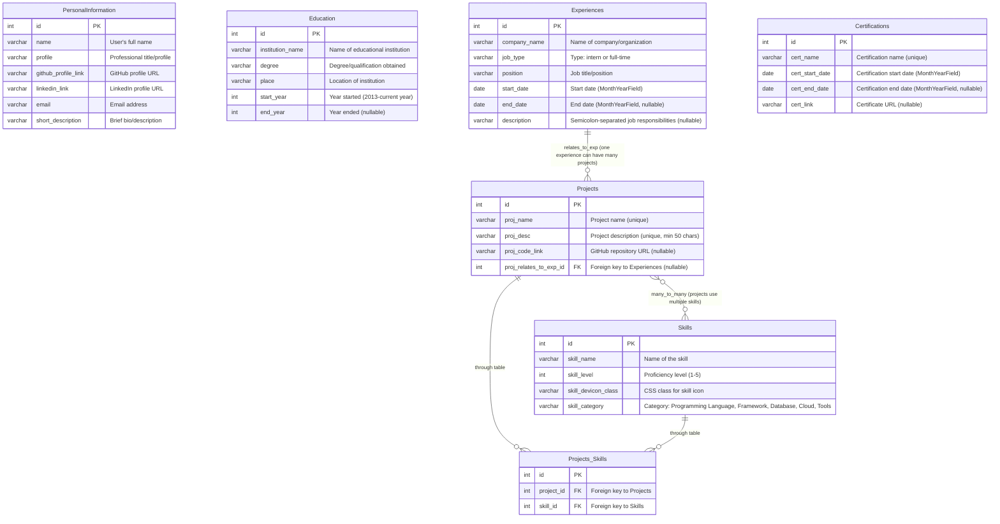

# Personal Resume Website

A dynamic personal resume website built with Django that showcases your professional experience, education, projects, skills, and certifications. The website features a responsive design and is powered by a SQLite database for easy content management.

## Features

- **Dynamic Content Management**: All content is stored in a SQLite database and can be managed through Django's admin interface
- **Responsive Design**: Mobile-friendly layout that works on all devices
- **Professional Sections**:
  - Personal Information & About
  - Work Experience
  - Education
  - Projects with GitHub links
  - Skills with visual icons
  - Certifications
- **Modern UI**: Clean, professional Bootstrap-based design
- **Admin Interface**: Easy content management through Django admin
- **Custom Date Fields**: Special month/year fields for dates
- **Skill Categories**: Organised skills by categories (Programming Languages, Frameworks, Databases, Cloud, Tools)

## Technology Stack

- **Backend**: Django
- **Database**: SQLite3
- **Icons**: Font Awesome, Devicons, Simple Line Icons
- **Fonts**: Google Fonts (Saira Extra Condensed, Open Sans)

## Project Structure

```
portfolio_website/
├── portfolio/                    # Main Django app
│   ├── migrations/              # Database migrations
│   ├── static/portfolio/        # Static files (CSS, JS)
│   ├── templates/portfolio/     # HTML templates
│   ├── templatetags/           # Custom template tags
│   ├── admin.py                # Admin interface configuration
│   ├── models.py               # Database models
│   ├── views.py                # View logic
│   ├── urls.py                 # URL routing
│   └── custom_field.py         # Custom form fields
├── portfolio_website/          # Project settings
│   ├── settings.py            # Django settings
│   ├── urls.py                # Main URL configuration
│   └── wsgi.py                # WSGI configuration
├── manage.py                   # Django management script
├── .gitignore                  # Git ignore file
└── README.md                   # Project documentation
```

## Database Models

The website uses the following Django models:

### PersonalInformation
- Name, profile title, email
- GitHub and LinkedIn profile links
- Short description/bio

### Experiences
- Company name, position, job type (intern/full-time)
- Start and end dates (custom month/year fields)
- Job description (semicolon-separated bullet points)

### Education
- Institution name, degree, location
- Start and end years
- Automatic ordering by date

### Skills
- Skill name, proficiency level (1-5)
- Category (Programming Language, Framework, Database, Cloud, Tools)
- Devicon class for visual representation

### Projects
- Project name and description
- Associated skills (many-to-many relationship)
- GitHub repository link
- Related work experience

### Certifications
- Certification name and dates
- Certificate link
- Expiration handling

# Database Schema



## Database Schema Overview

This entity-relationship diagram represents a portfolio/resume database with the following key entities:

- **PersonalInformation**: Stores user profile data
- **Education**: Academic background and qualifications
- **Experiences**: Professional work history
- **Skills**: Technical and professional skills with proficiency levels
- **Projects**: Portfolio projects linked to experiences
- **Certifications**: Professional certifications and credentials
- **Projects_Skills**: Junction table for many-to-many relationship between projects and skills

### Key Relationships

1. **Experiences → Projects**: One-to-many (an experience can relate to multiple projects)
2. **Projects ↔ Skills**: Many-to-many (projects use multiple skills, skills are used in multiple projects)


## Installation & Setup

### Prerequisites
- Python 3.8+
- pip (Python package manager)

### Installation Steps

1. **Clone the repository**
```bash
git clone <your-repo-url>
cd portfolio_website
```

2. **Create a virtual environment**
```bash
python -m venv venv
source venv/bin/activate  # On Windows: venv\Scripts\activate
```

3. **Install dependencies**
```bash
pip install django python-decouple
```

4. **Environment Configuration**
Create a `.env` file in the project root:
```env
DJANGO_SECRET_KEY=your-secret-key-here
DEBUG=True
ALLOWED_HOSTS=
```

5. **Database Setup**
```bash
python manage.py makemigrations
python manage.py migrate
```

6. **Create Superuser**
```bash
python manage.py createsuperuser
```

7. **Run the Development Server**
```bash
python manage.py runserver
```

Visit `http://127.0.0.1:8000/` to view your website and `http://127.0.0.1:8000/admin/` to manage content.

## Configuration

### Adding Content

1. **Access Admin Interface**: Navigate to `/admin/` and log in with your superuser credentials

2. **Add Personal Information**: 
   - Add your basic information, profile title, and social links
   - Use space-separated format for name/title to enable color splitting

3. **Add Skills**:
   - Include devicon class names for visual icons
   - Set proficiency levels (1-5)
   - Categorize skills appropriately

4. **Add Experience**:
   - Use semicolon-separated descriptions for bullet points
   - Dates are automatically formatted as month/year

5. **Add Projects**:
   - Link projects to related experiences
   - Associate relevant skills
   - Include GitHub repository links

6. **Add Education & Certifications**:
   - Fill in all relevant academic and professional credentials

### Custom Features

- **Date Formatting**: The website uses custom month/year fields for professional date display
- **Skill Icons**: Uses Devicon for technology skill visualization
- **Responsive Navigation**: Auto-hides sections with no content
- **Text Splitting**: Custom template filter for name/title color formatting

## Deployment

### Production Settings
1. Set `DEBUG=False` in your `.env` file
2. Configure `ALLOWED_HOSTS` with your domain
3. Set up static files serving
4. Use a production database

### Static Files
```bash
python manage.py collectstatic
```

## Template Attribution

This project is built upon the **"Resume - A Bootstrap 4, Simple Yet Exquisite CV Template"** with extensive modifications including:

- **Complete Django Backend Integration**: Converted static template to dynamic Django application
- **Database-Driven Content**: All content now managed through SQLite database with custom models
- **Admin Interface**: Added Django admin for easy content management
- **Custom Fields**: Implemented specialized form fields like month/year date pickers
- **Dynamic Relationships**: Created many-to-many relationships between projects and skills
- **Enhanced Functionality**: Added features like skill categorization, project linking, and certification management
- **Responsive Improvements**: Enhanced mobile responsiveness and user experience

**Template Source**: [ThemeWagon Free Bootstrap CV Template](https://themewagon.com/themes/free-bootstrap-4-cv-template-download/)

---
